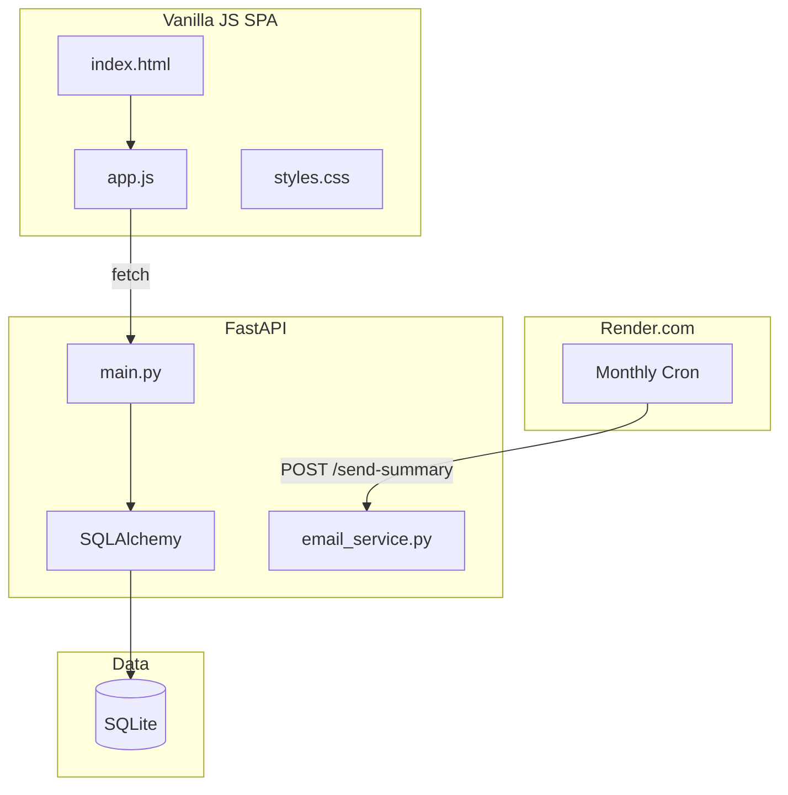

# TEACHME: Goals Tracker

> A couples' New Year's resolution tracker with confetti, accountability, and monthly nudges.

## The Problem This Solves

New Year's resolutions fail for predictable reasons:
1. You forget what you committed to
2. There's no accountability
3. Progress feels invisible
4. Life gets busy and goals drift

We wanted something that:
- Shows both partners' goals side-by-side (gentle competition)
- Visualizes progress (dopamine hits)
- Sends monthly reminders (nudges)
- Celebrates completion (confetti!)

## How It Works (The Mental Model)

Think of it as a **shared vision board with progress tracking**:

```
Goals → Milestones → Check-ins → Progress Ring → Confetti!
```

Each goal can have milestones (sub-steps). Check-ins are notes you add along the way. Progress is calculated automatically from milestone completion. Hit 100%? Confetti explodes across your screen.

The accountability angle: You see your partner's goals and progress. Nothing motivates like knowing someone's watching.

## Architecture at a Glance



**Simplicity is the feature:**
- No React, no Vue, no build step
- Just HTML, CSS, and vanilla JavaScript
- FastAPI serves both API and static files
- SQLite because it's one file to backup

## The Tech Stack (And Why)

| Layer | Choice | Why |
|-------|--------|-----|
| **Frontend** | Vanilla HTML/CSS/JS | No build step, deploy anywhere |
| **Backend** | FastAPI | Auto-docs, async, Python |
| **Database** | SQLite | Single file, easy backup |
| **Auth** | JWT in HTTP-only cookies | Secure, no localStorage |
| **Email** | Gmail SMTP | Free, App Passwords work |
| **Hosting** | Render.com | Free tier, cron jobs included |

**Why vanilla JS?** For a small app with 3 pages, React is overkill. The entire frontend is:
- `index.html` (single page)
- `app.js` (~640 lines)
- `styles.css` (~1000 lines)

No node_modules. No webpack. No "npm install 847 packages."

## Code Tour: The Key Files

| File | What It Does | Why It Matters |
|------|--------------|----------------|
| `backend/main.py` | All routes + static serving | The whole backend |
| `backend/database.py` | SQLAlchemy models | Goal, Milestone, CheckIn |
| `backend/email_service.py` | Monthly summary emails | HTML emails with stats |
| `frontend/index.html` | The entire UI | Single-page app |
| `frontend/app.js` | All interactivity | Fetch calls, modals, confetti |
| `frontend/styles.css` | Complete styling | Custom progress rings |

## Patterns Worth Stealing

### 1. SVG Progress Rings

Circular progress indicators using pure SVG:

```css
.progress-ring-circle {
    stroke-dasharray: 283;  /* Circumference */
    stroke-dashoffset: 283; /* Start empty */
    transition: stroke-dashoffset 0.5s ease;
}
```

Set `stroke-dashoffset` based on percentage. CSS handles the animation.

### 2. Auto-Progress from Milestones

When you complete a milestone, goal progress updates automatically:

```python
if goal.milestones:
    completed = sum(1 for m in goal.milestones if m.completed)
    total = len(goal.milestones)
    goal.progress = int((completed / total) * 100)
```

**Why this is great:** No manual "update progress" step. Complete tasks, see progress.

### 3. Canvas Confetti (No Library)

Custom confetti animation using HTML5 Canvas:

```javascript
function createConfetti() {
    const canvas = document.createElement('canvas');
    const ctx = canvas.getContext('2d');
    const particles = [];
    
    for (let i = 0; i < 150; i++) {
        particles.push({
            x: Math.random() * canvas.width,
            y: Math.random() * canvas.height - canvas.height,
            color: colors[Math.floor(Math.random() * colors.length)],
            // ... physics properties
        });
    }
    // Animation loop...
}
```

**Why this is great:** Confetti libraries are 50KB+. This is 50 lines.

### 4. Dual Auth: Cookies + Headers

```python
token = request.cookies.get("auth_token")
if not token:
    auth_header = request.headers.get("Authorization")
    token = auth_header.split()[1] if auth_header else None
```

Web UI uses cookies (secure, automatic). API clients use headers.

### 5. Render Cron for Monthly Emails

Instead of a separate worker:

```yaml
# render.yaml
services:
  - type: cron
    schedule: "0 9 1 * *"  # 9am on the 1st
    buildCommand: curl -X POST https://app.onrender.com/send-summary
```

The cron job just hits your own API endpoint. No separate service to maintain.

## Lessons Learned

### Bug: Cookie Not Sent Cross-Origin

**Problem:** JWT cookie wasn't being sent from frontend to API.
**Solution:** `credentials: 'include'` in fetch + CORS `allow_credentials=True`:
```javascript
fetch('/api/goals', { credentials: 'include' })
```

### Bug: SQLite Concurrent Access

**Problem:** Occasional "database is locked" errors.
**Solution:** WAL mode for better concurrency:
```python
engine = create_engine("sqlite:///goals.db?check_same_thread=False",
                       connect_args={"timeout": 30})
```

### Pitfall: bcrypt vs passlib

**Problem:** `passlib` is heavy and had deprecation warnings.
**Solution:** Use `bcrypt` directly:
```python
class SimplePasswordContext:
    def hash(self, password: str) -> str:
        return bcrypt.hashpw(password.encode(), bcrypt.gensalt()).decode()
    
    def verify(self, password: str, hashed: str) -> bool:
        return bcrypt.checkpw(password.encode(), hashed.encode())
```

### Discovery: Year-Based Goal Scoping

Goals have a `year` field. Every January, you start fresh but can still see previous years:

```python
@app.get("/api/goals")
def get_goals(year: int = 2026):
    return db.query(Goal).filter(Goal.year == year).all()
```

## If I Were Starting Over...

1. **Add recurring goals** — Some goals repeat yearly ("Read 12 books")
2. **Photo milestones** — Let people attach progress photos
3. **Goal templates** — Common goals like "Exercise 3x/week" pre-built
4. **More gamification** — Streaks, badges, year-end awards

## Mental Models

### Think: Goals = Containers

A goal isn't a task—it's a container for:
- The aspiration (description)
- The sub-steps (milestones)
- The journey (check-ins)
- The progress (auto-calculated)

### Think: Partners = Accountability Mirrors

Seeing your partner's progress creates gentle pressure:
- They're at 60%, you're at 30%
- No words needed—the numbers speak

### Think: Monthly Emails = Scheduled Reflection

Most people don't check goal apps daily. Monthly emails:
- Remind you the goals exist
- Show progress delta
- Include motivational quotes
- Link back to the app

The email is the primary touchpoint; the app is for updates.

---

*This document is part of Mark's personal engineering wiki. Last updated: 2026-02-01*
